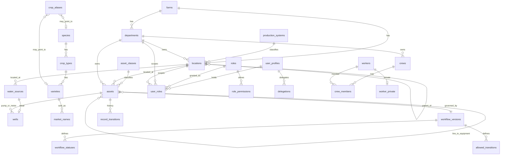

# Domain Model

Each entity is justified by the workflow that needs it. ✅ = built in Phase 1 (tested). ⏳ = designed, built in the named phase.
Every operational/master table has the standard contract: UUID id (client-generated for offline), `farm_id`, created/updated by/at,
`version`, `client_recorded_at`, `voided_at/by/void_reason`. Master tables also have `verification_status`, `verified_by/at` and `source_note`.

## Phase 1 entities

| Entity | Justifying workflow | Notes |
|---|---|---|
| ✅ farms | Tenancy (§3.15) | Name Not Yet Verified |
| ✅ departments | Every record has an owning department; QA independence | `is_independent` for QA |
| ✅ roles, role_permissions, user_roles, delegations | Who may plan/dispatch/execute/verify what, where, when | Six-dimension model, see PERMISSIONS.md |
| ✅ user_profiles | People who sign in | `auth.users` is owned by Supabase |
| ✅ devices | Shared crew phone, lost-device revoke | PIN switch UI in Phase 1b |
| ✅ settings | Configurable values with evidence tier | |
| ✅ units | Quantities always carry a unit; dunum ↔ m² ↔ ha | Item-level conversions in Phase 2 |
| ✅ production_systems | Separate records/costing per system (D6) | |
| ✅ locations (tree) | WHERE for every task, asset and reading; location-scoped roles | `path`, `area_basis`, D1 reconciliation view |
| ✅ asset_classes, assets | "Pump failed" → asset → work order; fleet; packhouse line → equipment | Type-neutral, status workflow |
| ✅ water_sources, wells | Irrigation source; 14 wells, not all active | No wells seeded; temporary codes flagged |
| ✅ species → crop_types → varieties → market_names, crop_aliases | Harvest lots, plantings, packing; internal names preserved (D2–D5) | Nothing seeded |
| ✅ workers, worker_private | Crew labour recorded by the supervisor; privacy | Workers are records, not accounts |
| ✅ crews, crew_members | 6 AM crew assignment | Time-bounded, no overlap |
| ✅ workflow_versions, workflow_statuses, allowed_transitions | Every status change, versioned | |
| ✅ record_transitions | Status history (asset/well status history and all later histories) | Generic instead of one history table per entity |
| ✅ processed_mutations, sync_conflicts | Offline retries and rejected replays | |
| ✅ audit_events | Who/what/when/old/new for everything | Append-only |

## Later phases (designed now so the traceability chain never breaks)

Field/Block → Growing cycle → Activity records (incl. PPP) → Harvest order → Harvest lot/bin → Receiving → Pack lot (n:m with mass balance) → Cold storage → Pallet → Dispatch.

| Phase | Entities |
|---|---|
| 2 | plans, work_orders, task_types (+ 1:1 extension tables), tasks, task_checklist_items, labour_entries, machine_entries, material_consumptions, verifications, problem_reports, triage_decisions, escalation_rules, escalations, attachments, comments, notifications. Main Warehouse core: warehouses, item_categories, items, item_units, stock_movements (immutable ledger), stock_balances, issue_requests |
| 3 | growing_cycles, ppp_applications (REI/PHI), harvest_orders, harvest_lots, bins |
| 4 | irrigation_zones, irrigation_zone_locations (time-bounded), reading_types, readings, irrigation runs (task type extension) |
| 5 | maintenance_requests, maintenance_work_orders, pm_schedules, downtime_events |
| 6 | item_asset_links, reorder flags (Maintenance Warehouse on the shared inventory engine) |
| 8 | packhouse_lines/stages (configured order), packhouse_shifts, receiving_records, pack_lots, pack_lot_inputs, cold_storage_logs, pallets, dispatches |
| 9 | inspection_templates, inspection_parameters, samples, inspections, quality_results, quality_holds, qa_standards, qa_audits, qa_findings, corrective_actions |
| 10 | rates (nullable, sourced, verification status), KPI definitions |

## ER diagram (Phase 1)

## Deviations from Master Prompt §3.4 (justified)
1. `user_profiles` instead of `users`, because Supabase owns `auth.users`.
2. `record_transitions` is one generic status-history table instead of `well_status_history`, `asset_status_history`, etc. One history works for every workflow and is written by the one transition function.
3. `worker_private` split out for privacy enforced by RLS.
4. `wells` uses `water_source_id` as its key (a 1:1 subtype). Its `id` is a generated copy, so the standard contract applies.
