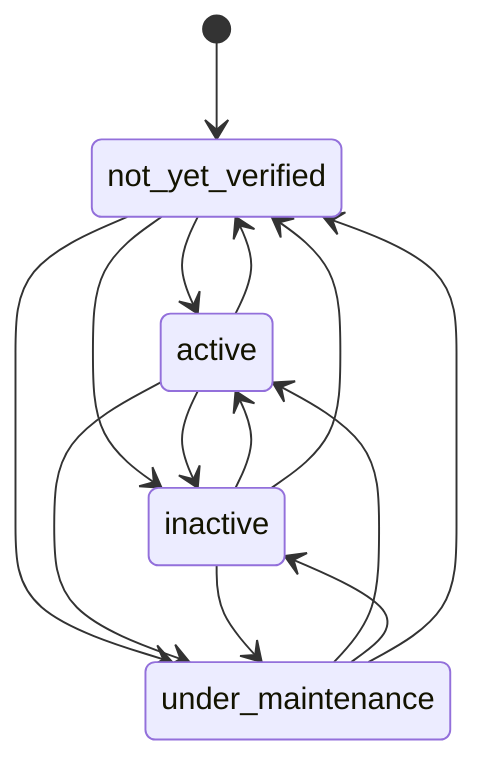
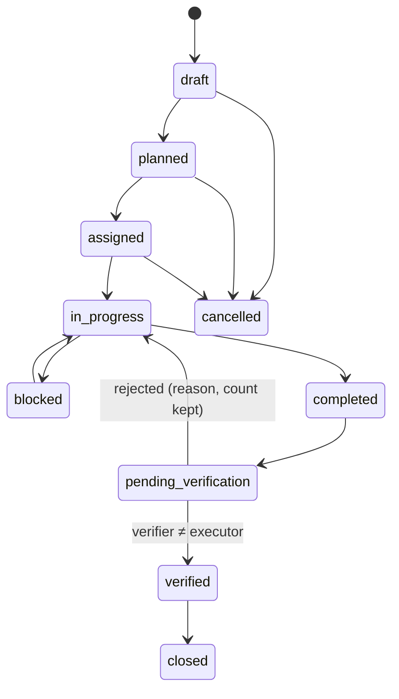
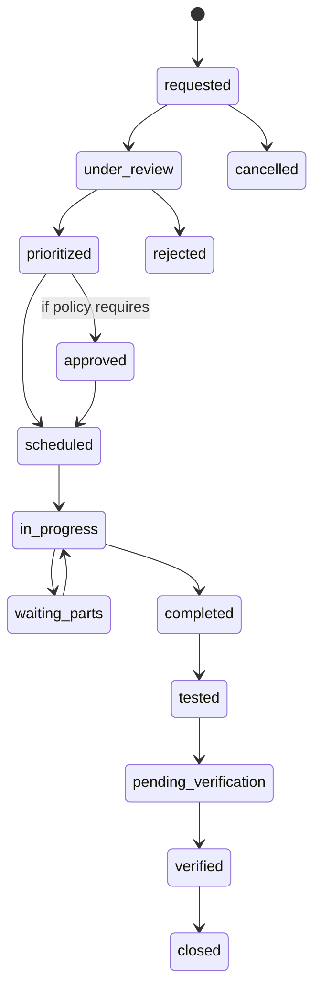

# State Machines

Implemented as data (`workflow_versions`, `workflow_statuses`, `allowed_transitions`) and enforced by `transition_record()`.
Records keep the workflow version they started under. Changing rules means publishing a new version, because published versions are frozen.
Each transition row names the permission action, required fields and `must_differ_from` (segregation of duties).

## Implemented (Phase 1)

### Asset / water-source status — `asset_status` v1 (VR-C10)
Every change requires `configure` plus a reason (`comment`). New records always start in **Not Yet Verified**. No seed sets Active.

### Task — `task` v1 (Phase 2, implemented; VR-C18)
Path depends on the task type (`guard`): with verification → `pending_verification → verified → closed`; without → `completed → closed`.
`verified/completed → in_progress` (reopen for correction) needs `review` + reason. `pending_verification → in_progress` (send back) needs `verify` + reason and increments `rejection_count`. Block needs a reason (material, equipment, water, labour, weather, access, other); resuming clears it.

### Problem report — `problem_report` v1 (Phase 2, implemented)
`open → acknowledged → converted` (only through `triage_problem_report()`, which creates the work order/task) · `→ resolved` / `→ rejected` with a reason.

### Stock issue request — `issue_request` v1 (Phase 2, implemented; VR-C19)
`requested → (approved) → partially_issued → issued → received`; `rejected` (warehouse, reason), `cancelled` (requester, reason).

## Starting definitions for later phases (from Master Prompt §3.5; seeded as data when the phase starts)

### Task (diagram)

Task types may skip verification only when their policy says so.

### Maintenance work order (Phase 5)

### Irrigation run (Phase 4)
`planned → scheduled → in_progress → completed (actual water; fertilizer where applicable) → pending_verification → verified`, plus `exception/interrupted`.

### Plant-protection application (Phase 3)
`planned → approved → materials_issued → applied → recorded → verified`. Generates REI/PHI windows on the block. Harvest on that block inside PHI is blocked unless an authorised, logged override exists.

### Harvest lot (Phase 3)
`created → in_transit → received → inspected → accepted | on_hold | rejected`

### Quality hold (Phase 9)
`placed → under_review → released | rejected_disposed`. Authority comes from the QA matrix (E3, Not Yet Verified, configurable).

### QA finding (Phase 9)
`raised (QA) → acknowledged (owning department) → corrective_action_in_progress → submitted → verified (QA) → closed (QA only)`

### Stock issue request (Phase 2)
`requested → approved (if policy) → issued → received_confirmed | partially_issued | rejected`
